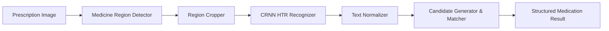

# Medication Name Understanding, Normalization & Matching

> **CRITICAL MEDICAL SAFETY DISCLAIMER**  
> **"This component identifies possible medication identities from recognized prescription text. It does not prescribe medication or determine patient-specific treatment."**  
> The medication matching system strictly performs visual and linguistic transcription, normalization, and catalog-grounded entity resolution. It **NEVER** prescribes drugs, infers therapeutic indications, recommends dosages or schedules, diagnoses patients, or hallucinates ungrounded medical facts.

---

## 1. Architectural Overview

The medication understanding layer is located in [`backend/src/prescriptions/medications/`](file:///e:/projects/AI%20Medical%20Image%20Analysis/backend/src/prescriptions/medications/) and operates as an independent, modular subsystem decoupled from handwriting recognition (HTR), computer vision models, and frontend presentation logic.

```
medications/
├── __init__.py                # Package exports
├── normalizer.py              # Text cleaning, Arabic transliteration, strength & dosage form parsing
├── candidate_generator.py     # Deterministic, transliteration, alias, and multi-metric fuzzy matching
├── matcher.py                 # Master orchestrator resolving raw text to grounded concepts
├── confidence.py              # Calibrated confidence scoring and clinical candidate status classification
├── schemas.py                 # Pydantic schemas (MedicationConcept, StrengthInfo, DosageFormInfo, etc.)
└── providers/
    ├── __init__.py            # Provider exports
    ├── base.py                # MedicationInfoProvider abstract interface
    ├── rxnorm.py              # NLM RxNav REST API provider with resilient caching & timeout fallback
    └── egypt.py               # Egyptian Drug Authority (EDA) reference catalog & future ingestion interface
```

---

## 2. Text Normalization Pipeline

Raw OCR/HTR outputs undergo multi-stage deterministic normalization:

1. **Whitespace & Control Character Sanitization**: Strips leading/trailing spaces, collapses multiple internal spaces, and strips newlines.
2. **Punctuation & Noise Cleaning**: Preserves decimal dots (`0.5%`, `1.5g`) and slashes (`/`), while removing stray leading/trailing quotes, hashes, and non-alphanumeric artifacts.
3. **OCR Space Split Merging**: Heuristically merges split medication roots (e.g., `"Augm entin"` → `"Augmentin"`, `"Amox icillin"` → `"Amoxicillin"`, `"Parace tamol"` → `"Paracetamol"`).
4. **OCR Character Substitution Repair**: Corrects common intra-word alpha OCR errors (e.g., `"Augmentln"` / `"Augment1n"` → `"Augmentin"`, `"Am0xil"` → `"Amoxil"`).
5. **Arabic Script Normalization**:
   - Strips tashkeel (diacritics: fatha, damma, kasra, tanwin, shadda, sukun).
   - Strips tatweel (kashida).
   - Unifies Alef variants (`أ إ آ ٱ` → `ا`), Yaa/Alef Maqsura (`ى` → `ي`), and Taa Marbuta (`ة` → `ه`).
6. **Strength & Unit Extraction**: Separates numeric magnitude and units (`mg`, `g`, `mcg`, `µg`, `ml`, `%`, `مجم`, `جم`, `مل`) without destroying original raw strings.
7. **Dosage Form Extraction**: Explicitly identifies dosage forms when visible (`tablet`/`tab`/`قرص`, `capsule`/`cap`/`كبسول`, `syrup`/`شراب`, `suspension`/`معلق`, `ampoule`/`amp`/`أمبول`, `drops`/`قطرة`, `ointment`/`مرهم`, `cream`/`كريم`).

---

## 3. Candidate Generation & Fuzzy Matching

Candidate generation operates deterministically across multiple tiers:

1. **Tier 1 — Exact Brand/Generic Search**: Direct lookup against local catalogs and external registries.
2. **Tier 2 — Transliteration Search**: Resolves Arabic phonetic equivalents to canonical Latin brand names (e.g., `"أوجمنتين"` → `"Augmentin"`, `"كاتافلام"` → `"Cataflam"`, `"بانادول"` → `"Panadol"`).
3. **Tier 3 — Known Alias & Synonym Match**: Evaluates registered brand aliases and international nonproprietary names (INN).
4. **Tier 4 — Multi-Metric String Similarity**: Evaluates candidate proximity using a weighted composite metric:
   $$\text{Score} = 0.45 \cdot \text{Levenshtein}_{\text{norm}} + 0.35 \cdot \text{Jaro-Winkler} + 0.20 \cdot \text{Dice}_{n=2}$$
   - Prefix match weighting handles truncated handwriting abbreviations (e.g., `"Augm..."` → `"Augmentin"`).
   - Minimum fuzzy matching threshold: `0.40`.

---

## 4. Confidence Policy & Candidate Classification

Candidates are scored and assigned transparent status levels:

| Threshold Range | Status Code | Clinical Meaning | User Presentation |
| :--- | :--- | :--- | :--- |
| $\ge 0.85$ | `CONFIRMED_CANDIDATE` | High-confidence exact or alias match with catalog confirmation | Confirmed Candidate |
| $0.60 \le \text{Conf} < 0.85$ | `POSSIBLE_CANDIDATE` | Medium-confidence candidate; plausible match requiring user review | Possible Candidate (Verification Recommended) |
| $0.40 \le \text{Conf} < 0.60$ | `UNCERTAIN` | Low-confidence fuzzy match or ambiguous partial abbreviation | Uncertain (Requires Verification) |
| $< 0.40$ | `UNMATCHED` | No catalogued medication matches within safe similarity threshold | Unmatched Medication |

### Ambiguity Penalty & OCR Calibration
- If two distinct candidates yield nearly identical similarity scores ($\Delta < 0.05$), an **ambiguity penalty** ($10\%$) is applied to prevent overconfident misidentification.
- When handwriting recognition confidence is available, it is factored proportionally into composite scoring without overriding hard exact matches.

---

## 5. Provider Architecture

### `MedicationInfoProvider` Interface
Abstract base provider exposing:
- `search(query: str, limit: int = 5) -> List[MedicationConcept]`
- `get_by_identifier(identifier: str) -> Optional[MedicationConcept]`
- `find_candidates(query: str, limit: int = 5) -> List[MedicationConcept]`
- `get_provider_info() -> Dict[str, str]`

### 1. NLM RxNorm / RxNav Provider (`RxNormProvider`)
- Integrates with the official US National Library of Medicine (NLM) RxNav REST API (`https://rxnav.nlm.nih.gov/REST`).
- Uses `/drugs.json` for exact and clinical concept mapping and `/approximateTerm.json` for approximate phonetic lookup.
- **Resilience & Fallback**: Configured with timeouts ($3.0\text{s}$ default), exponential backoff retries, and in-memory LRU cache ($500$ entries). Network timeouts or HTTP 5xx errors fail gracefully without crashing inference.

### 2. Egyptian Medication Provider (`EgyptianMedicationProvider`)
- Tailored for Egypt's domestic pharmaceutical market.
- Seeded with essential reference medications (e.g., Augmentin, Cataflam, Congestal, Antinal, Flagyl, Brufen, Voltaren, Omeprazole, Septazole, Amoxil, Klavimox, Hibiotic, Alphintern, Cidophage, Controloc, etc.).
- Exposes `register_record(...)` and `ingest_dataset(...)` to support future batch ingestion of official Egyptian Drug Authority (EDA) licensed databases.

---

## 6. Pipeline Integration

The master pipeline [`PrescriptionRecognitionPipeline`](file:///e:/projects/AI%20Medical%20Image%20Analysis/backend/src/prescriptions/pipeline/prescription_pipeline.py) automatically runs `MedicationMatcher` on each detected region:



---

## 7. Safety Boundaries & Grounding Guarantees

1. **No Hallucination**: No medication concept is emitted unless grounded in a registered catalog (EDA seed or RxNorm).
2. **No Clinical Inference**: The engine never infers why a drug was prescribed, nor does it deduce patient diagnoses or disease indications.
3. **No Treatment Recommendations**: The system does not suggest dosage adjustments, drug schedules, treatment durations, or therapeutic alternatives.
4. **Verbatim Preservation**: The original raw OCR text is strictly preserved in `raw_text` alongside `normalized_text`.

---

## 8. Test Coverage & Verification

Automated tests in [`backend/tests/test_medications.py`](file:///e:/projects/AI%20Medical%20Image%20Analysis/backend/tests/test_medications.py) test:
- Whitespace, casing, punctuation, and OCR spacing/character normalization.
- Arabic text normalization and transliteration.
- Strength and unit parsing across English and Arabic tokens.
- Dosage form extraction (and verifying `None` when absent).
- Multi-metric string similarity calculations.
- RxNorm provider mock success, network timeout resilience, and HTTP 500 error handling.
- Egyptian provider exact, Arabic, and future ingestion mechanisms.
- Ambiguity and low-confidence uncertainty enforcement.
- Clinical safety boundary assertions.
