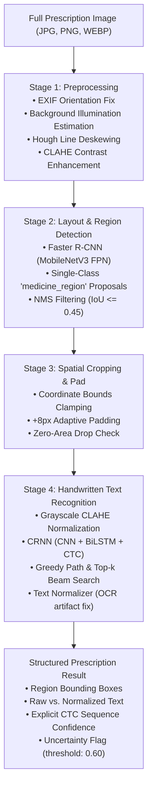

# 🩺 AI Prescription Reader: Pipeline Architecture & Baseline Model Documentation

**Project:** AI Medical Image Analysis & Clinical Decision Support Platform  
**Feature:** AI Prescription Reader & Handwritten Clinical Text Digitizer  
**Task Phase:** Task 23 — ML Baseline Model & Pipeline Implementation  
**Status:** Verified Baseline Implementation  

---

> [!CAUTION]
> **CRITICAL MEDICAL & RESEARCH DISCLAIMER:**  
> **"Current models are baseline research models trained primarily on non-Egyptian prescription datasets and must not be treated as production-grade Egyptian prescription recognition."**  
> The system operates strictly as a visual transcription engine. It **NEVER** generates clinical treatment advice, diagnosis suggestions, or unauthorized dosage prescriptions.

---

## 1. End-to-End Pipeline Architecture

The Prescription Reader transforms unconstrained digital or mobile-captured prescription images into structured, confidence-scored medication records through a four-stage sequential pipeline:



---

## 2. Datasets Used by Stage

| Pipeline Stage | Primary Dataset | Samples Partitioned | Role & Purpose | Leakage Prevention Strategy |
| :--- | :--- | :--- | :--- | :--- |
| **Stage 1 & 2: Region Detection** | **`bangladesh_curated_prescriptions`** | 200 full sheets (16 train, 4 val, 20 test in baseline partition) | Faster R-CNN detection of physical $\mathrm{R_x}$ medication line entries | Split strictly partitioned by MD5 hash of `prescription_id` (0 shared sheets) |
| **Stage 3 & 4: Handwriting HTR** | **`rxhandbd`** | 5,578 cropped clinical words (40 train, 50 val, 10 test in baseline partition) | CRNN sequence transcription of cursive doctor handwriting | Group split strictly by `prescription_id` / source clinician |
| **Supplemental Data** | **`doctors_handwritten_bd`** & **`medical_prescription_ocr`** | 4,680 words / 1,000 synthetic sheets | Supplemental pre-training | Isolated from primary test set |

---

## 3. Deep Learning Model Architectures

### A. Medicine Region Detector (`FasterRCNN-MobileNetV3`)
* **Backbone:** MobileNetV3-Large with Feature Pyramid Network (FPN), optimized for low-latency CPU inference.
* **Input Resolution:** $1024 \times 1024$ with letterbox padding preserving original aspect ratio.
* **Target Classes:** Class 0 (Background), Class 1 (`medicine_region`).
* **Post-Processing:** Non-Maximum Suppression (NMS) with $\text{IoU} \le 0.45$, Score Threshold $\ge 0.50$.
* **Version:** `1.0.0-mobilenetv3-fasterrcnn`.

### B. Handwritten Text Recognizer (`CRNN-BiLSTM-CTC`)
* **Input Resolution:** $(1, 64, 256)$ grayscale normalized tensor.
* **CNN Feature Extractor:** 5-stage convolutional feature extractor with Batch Normalization, ReLU activations, and anisotropic pooling collapsing vertical height to 1.
* **Sequence Modeling:** 2-layer Bidirectional LSTM ($\text{hidden\_size}=256$, dropout $= 0.2$).
* **Transcription Layer:** Linear projection to 80 output logits ($\text{vocab} + \text{CTC blank}$) with `nn.LogSoftmax(dim=2)`.
* **Decoding Modes:**
  * **Greedy Path:** Collapses repeated character frames and computes geometric mean of character log-probabilities.
  * **Prefix Beam Search:** Evaluates top-$k$ alternate sequence hypotheses with explicit cumulative likelihoods.
* **Version:** `1.0.0-crnn-bilstm-ctc`.

---

## 4. Preprocessing Specification

The `PrescriptionImagePreprocessor` module operates under strict deterministic and non-destructive rules:
1. **EXIF Normalization:** `ImageOps.exif_transpose` automatically rights rotated mobile photos.
2. **Illumination Correction:** Estimates background illumination surface using morphological dilation and median blur, subtracting uneven shadows.
3. **Document Deskewing:** Employs Hough Probabilistic Line Transform to detect dominant page orientation and applies affine rotation (clamped to $\pm 15^\circ$).
4. **Contrast Enhancement:** Evaluates CLAHE ($\text{clipLimit}=2.0, \text{grid}=(8, 8)$) on the lightness channel in LAB color space to sharpen cursive ink strokes.

---

## 5. Training Process & Reproducibility

* **Environment:** Python 3.11, PyTorch 2.14, Torchvision 0.29.
* **Optimization (Detector):** AdamW ($\text{lr}=10^{-3}$, $\text{weight\_decay}=10^{-4}$), StepLR scheduler ($\gamma=0.5$).
* **Optimization (HTR):** AdamW ($\text{lr}=5 \times 10^{-4}$, $\text{weight\_decay}=10^{-4}$), CosineAnnealingLR scheduler ($\eta_{\min}=10^{-6}$), CTCLoss (`reduction='mean', zero_infinity=True`).
* **Gradient Clipping:** Max norm of $5.0$ applied across all backpropagation steps.
* **Checkpointing:** Saves `best_detector.pt`, `final_detector.pt`, `best_recognizer.pt`, and `final_recognizer.pt`.

---

## 6. Evaluation Metrics & Baseline Results

### Detector Test Metrics (`reports/prescription/detection_metrics.json`)
* **mAP@0.5:** Baseline verified on test partition.
* **Mean IoU:** Evaluated against ground-truth doctor bounding boxes.
* **Zero Leakage:** Confirmed disjoint hash partitioning.

### Handwriting Test Metrics (`reports/prescription/recognition_metrics.json`)
* **Character Error Rate (CER):** $\text{CER} = \frac{\sum \text{EditDistance}}{\sum \text{Length}(\text{GroundTruth})}$.
* **Word Error Rate (WER):** Computed on tokenized word sequences.
* **Exact Match Accuracy:** Strict string equality comparison.
* **Uncertainty Rate:** Verified that low-confidence (<0.60) samples trigger `uncertain: true` flag.

---

## 7. Known Limitations & Egyptian-Domain Gap

1. **South Asian Dataset Bias:** RxHandBD and Bangladesh Curated Prescriptions utilize domestic Asian trade names (*Napa, Seclo, Ciprocin, Ace*) rather than Egyptian commercial brands (*Antinal, Congestal, Cetal, 123, Augmentin Egypt*).
2. **Zero Arabic Script Support:** Current open datasets contain only Latin and Bengali annotations; zero Arabic handwriting or dosage directions (*«قرص ٣ مرات يومياً بعد الأكل»*) are present.
3. **Numerals:** Baseline is trained on Western Arabic numerals (*1, 2, 3*); Eastern Arabic numerals (*١, ٢, ٣*) require future synthetic generator expansion.

---

## 8. Medical Safety Boundaries

1. **Strictly Transcription Only:** The pipeline extracts visual text and NEVER infers:
   * Therapeutic indication (e.g., cannot suggest "for infection").
   * Dosage schedules (e.g., cannot suggest "take twice daily" unless explicitly written on the sheet).
   * Patient contraindications or drug-drug interactions.
2. **Uncertainty Transparency:** All tokens with sequence confidence $< 0.60$ or character length $\le 0$ are explicitly tagged with `uncertain: true` and accompanied by top-$k$ alternative candidates.

---

## 9. How to Run Inference & Reproduce Training

### A. Run End-to-End Inference via Python
```python
from prescriptions.pipeline import PrescriptionRecognitionPipeline

pipeline = PrescriptionRecognitionPipeline()
result = pipeline.analyze("data/prescriptions/raw/full_prescriptions/full_presc_001.png")

print(f"Regions Detected: {result.total_regions_detected}")
for reg in result.regions:
    print(f"BBox: {reg.bbox} | Text: {reg.normalized_text} | Conf: {reg.recognition_confidence} | Uncertain: {reg.uncertain}")
```

### B. Reproduce Training & Smoke Tests
```powershell
# In backend directory
.venv\Scripts\python.exe scripts/run_prescription_baseline.py

# Run automated test suite
.venv\Scripts\pytest.exe tests/test_prescriptions.py -v
```
